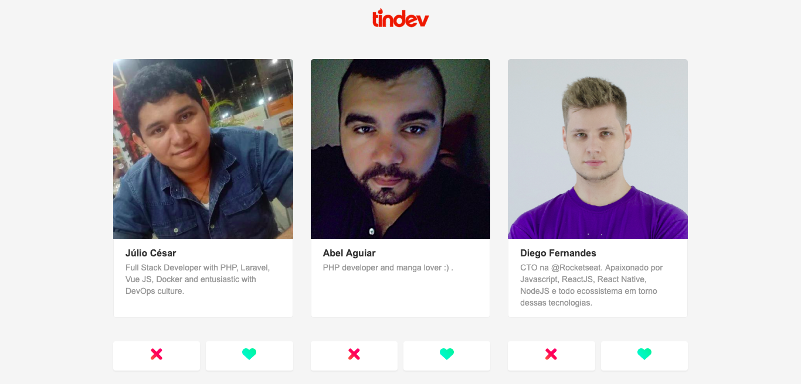

# OmniStack 8
## Tindev

### Backend
Node
````
cd backend
yarn install
yarn dev
````

### Frontend
ReactJs
````
cd frontend
yarn install
yarn start
````

### Mobile
````
cd mobile
yarn install
````
#### Android
````
react-native run-android
````
#### IOS
````
react-native run-ios
````

